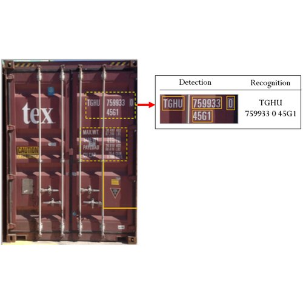
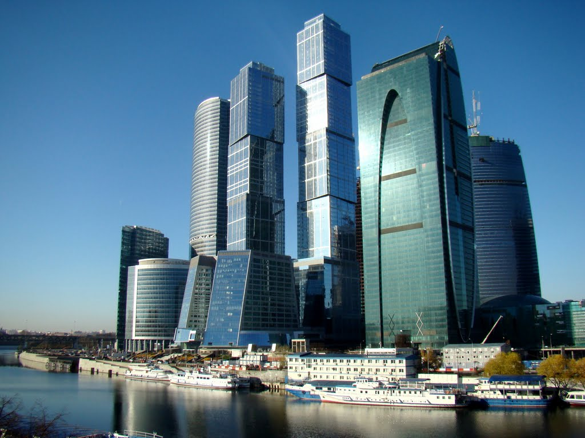
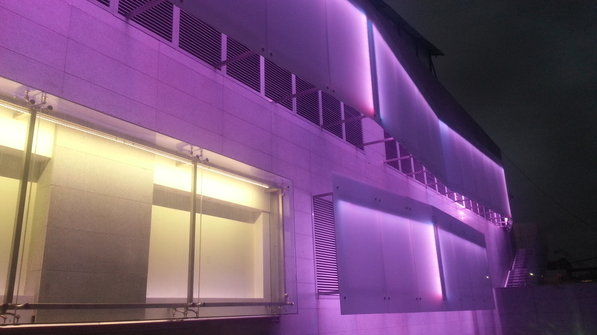
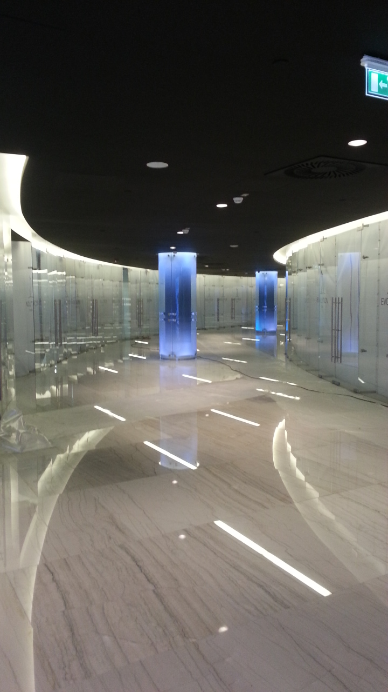
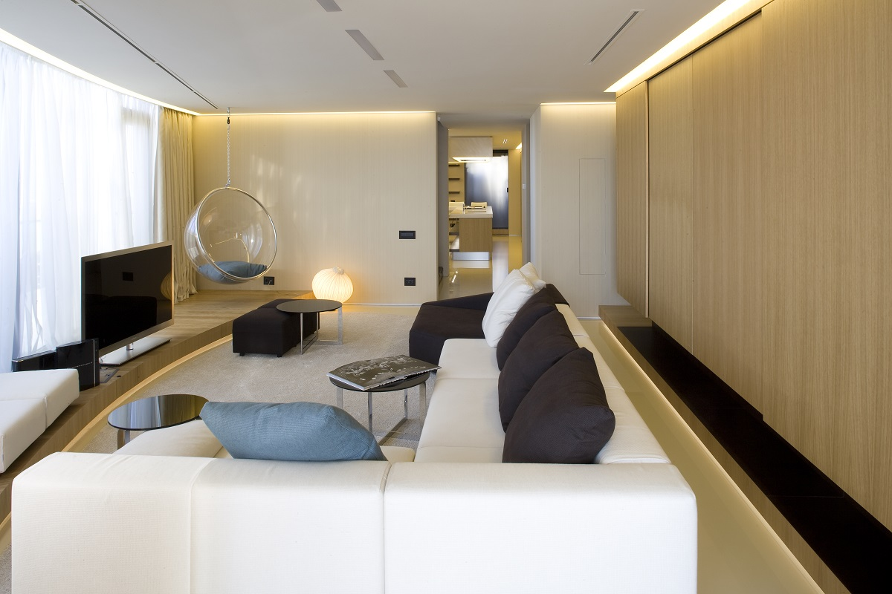
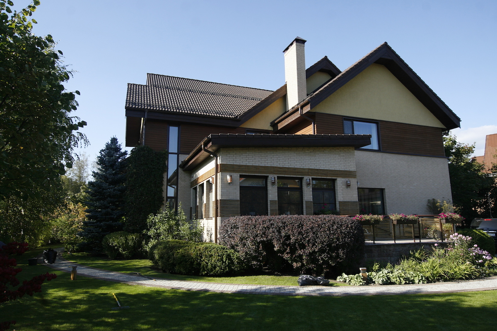
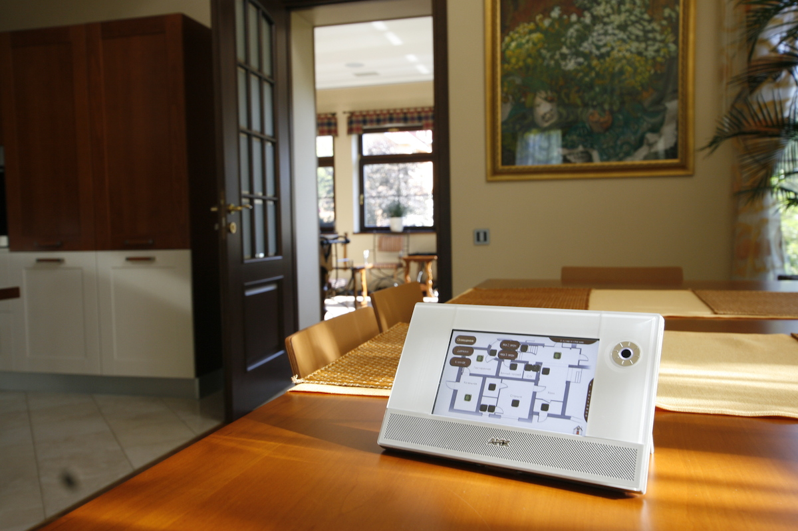
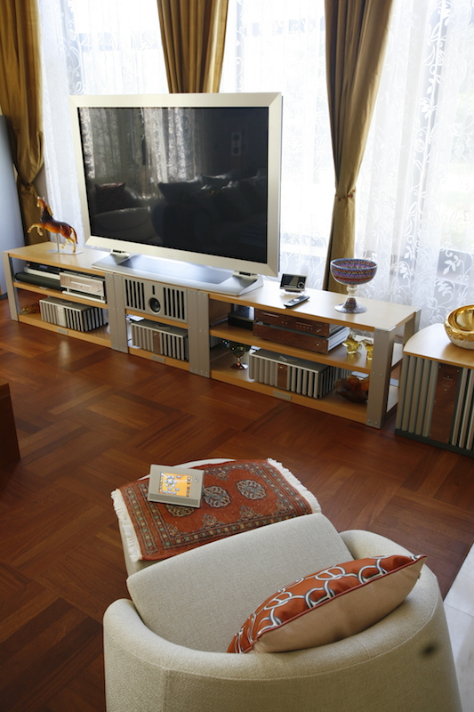
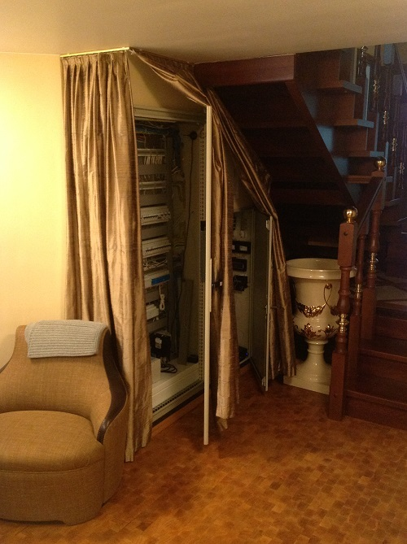

```{r setup, include=FALSE}
knitr::opts_chunk$set(
  include = TRUE
  , echo = FALSE
  , warning = FALSE
  , message = FALSE)
```


## 基本信息

<table class="custom_table", style="border: 0px solid transparent;">
  <tr>
   <td style="vertical-align: middle">  中文姓名
                                        <br>
                                        <br>
                                        <br>联系方式
   </td><td style="vertical-align: middle "> Kushnazarov Farruh 
                                        <br> 法如赫
                                        <br>
                                        <br> 173-2116-0407 
                                        <br> k.farruh@bk.ru 
   </td><td style="text-align:center" colspan="2">  
   </td>
  </tr><tr>
   <td> 专业 
   </td><td colspan="3"> 数学建模，数值计算与计算机程序相结合
   </td>
  </tr><tr>
   <td> 教育背景
   </td><td colspan="3">俄罗斯联邦圣彼得堡亚历山大一世皇帝交通大学 – 博士学位

   </td>
  </tr><tr>
   <td> 语言能力
   </td><td> 英语 
   </td><td> 俄语 
   </td><td> 汉语

  </tr><tr>
   <td> 
   </td><td> 工作熟练
   </td><td> 母语水平
   </td><td> 在学，日常会话水平
   </td>
  </tr>
</table>

# 与自然语言处理相关的项目

## 语言口音检测
- **说明**：每个人说话的时候都会有口音。该项目为讲英语的人定义了口音.
- **结果**：为母语和非母语人士创建并测试了语音重音分类系统，召回率达99％.
- **链接**：https://github.com/k-farruh/speech-accent-detection

## ASR-自动语音识别
- **说明**：为自动语音识别实施并重新培训了Mozilla DeepSpeech库。 Mozilla ASR是一个开放源代码的语音转文本引擎，使用了基于百度深度语音研究论文的机器学习技术训练的模型。
- **结果**：创建并测试了具有82％的英国口音和86％的美国口音准确性的ASR系统。

## 文字分类项目
- **目标**：分类为10个不同的主题。
- **数据来源**：
    - 标题：5-10个字
    - 说明：20-50个字
    - 文字1：200-400字
    - 文字2：600-1500字
-**方法**：LDA
-**结果**：10个主题和10个子主题。 <br>准确度87％

# 计算机视觉项目

## 集装箱号码识别（CNR）
CNR在后勤港口和搬运起重机中执行ISO 6346集装箱规范的读取和识别。智能系统使我们能够从一个邮政站管理多条车道，并不仅对集装箱而且对负责运输的卡车进行访问控制和有效识别。 CNR基于深度学习，光学字符识别的技术。

<a target="_blank" href="input/img/computer_vision/container_number/cn1.jpg">
  
</a>
<a target="_blank" href="input/img/computer_vision/container_number/cn2.png">
  
</a>
<a target="_blank" href="input/img/computer_vision/container_number/cn3.png">
  
</a>

# 客户生命周期项目

## 介绍
在以下五个阶段的基础上，采取相应措施以增加和保留客户。

客户生命周期包括以下五个阶段：

1. 覆盖-吸引未来客户的注意；
1. 习得-将他们带入势力范围；
1. 转换-将其转换为注册客户，而不是付费客户；
1. 保留-将他们保留为客户；
1. 忠诚度/倡导力-使他们成为公司的拥护者

http://mts.intechopen.com/articles/show/title/consumer-life-cycle-and-profiling-a-data-mining-perspective

## 到达：流量配置文件系统

<table>
 <thead>
  <tr>
   <th style=“text-align：right;”>序号</th>
   <th style=“text-align：left;”>目标</th>
   <th style=“text-align：left;”>数据源</th>
   <th style=“text-align：left;”>方法</th>
   <th style=“text-align：left;”>结果</th>
  </tr>
 </thead>
<tbody>
  <tr>
   <td style=“text-align：right;”> 1 </td>
   <td style=“text-align：left;”>对销售线索进行排名并为销售团队节省时间</td>
   <td style=“text-align：left;”>来自客户浏览器的信息</td>
   <td style="text-align:left;vertical-align: middle !important;" rowspan="3">马尔可夫链决策树</td>
   <td style=“text-align：left;”>将销售人员的时间节省了23％</td>
  </tr>
  <tr>
   <td style=“text-align：right;”> 2 </td>
   <td style=“text-align：left;”>提高周转率</td>
   <td style=“text-align：left;”>媒体信息</td>
   <td style=“text-align：left;”>流动率提高到25％</td>
  </tr>
  <tr>
   <td style=“text-align：right;”> 3 </td>
   <td style=“text-align：left;”>检测机器人创建的销售线索</td>
   <td style=“text-align：left;”>会话页面信息</td>
   <td style=“text-align：left;”>将营销费用减少了14％</td>
  </tr>
</tbody>
</table>

## 获取-重新激活的潜在顾客积分系统
- **目标**：提高重新激活的潜在客户的整体注册率。
- **数据来源**：着陆页数据，设备，位置，估算年龄，着陆时间等。
- **方法**：随机森林
- **结果**：注册率提高了两倍。

## 转换-客户续订
- **目标**：提高整体续约率；总结主要影响因素；估算合同生命周期内的电话数量和通话时间。
- **数据来源**：类数据；老师和学生的数据。
- **方法**：随机森林（提升）
- **结果**：续约率提高了30％。
- **新闻链接**：
    -https://www.tutorabc.com.cn/About/NewsDetail/9848.html


## 保留-客户流失（因果）
- **目标**：降低客户退款率，这将增加投资回报率（ROI）。由于单量平均成交价较高，则需要通过尽可能精准的量度来预测可能发生的退款数额。
- **数据来源**：学生-客户，教师的数据以及与客户购买的产品相关的数据。
-方法：逻辑回归和随机森林。
- **结果**：退款率降低到27％。
- **新闻链接**：
    -https://www.tutorabc.com.cn/About/NewsDetail/9889.html
    -https://www.tutorabc.com.cn/About/NewsDetail/9882.html


# 与智慧城市相关的项目

## 简介
在俄罗斯Domus Sapiens 公司,作为一名程序专家,我主要负责数据分析和项目管理工作。
在各智能建筑项目中独立完成了全套智能系统的设计和编程工作。其中，最著名和最复杂的案例之一是莫斯科市智能系统开发。

http://domussapiens.ru/

## 莫斯科市智慧夜项目
- 莫斯科市项目由5个不同的办公大楼小组完成，这些小组对智能系统和链接的要求各不相同。
- 公司的主要工作是对中心控制和夜灯调节进行计算机编程。
- 覆盖面积超过800平方米
- 来自不同控制器的15000个信号

<a target="_blank" href="input/img/smart_city/moscow_city/ms1.jpg">
  
</a>
<a target="_blank" href="input/img/smart_city/moscow_city/ms2.jpg">
  
</a>
<a target="_blank" href="input/img/smart_city/moscow_city/ms3.jpg">
  
</a>
<a target="_blank" href="input/img/smart_city/moscow_city/ms4.jpg">
  
</a>
<a target="_blank" href="input/img/smart_city/moscow_city/ms5.jpg">
  
</a>
<a target="_blank" href="input/img/smart_city/moscow_city/ms6.jpg">
  
</a>
<a target="_blank" href="input/img/smart_city/moscow_city/ms7.jpg">
  
</a>
<a target="_blank" href="input/img/smart_city/moscow_city/ms8.jpg">
  
</a>


## 智能老式公寓
- 照明，窗帘，通风的自动化，
- 泄漏监控
- 通过平板电脑和计算机控制家庭影院
- 全覆盖Wi-Fi网络

<a target="_blank" href="input/img/smart_city/old_style_appartment/pobedy1.jpg">
  
</a>
<a target="_blank" href="input/img/smart_city/old_style_appartment/pobedy2.jpg">
  
</a>
<a target="_blank" href="input/img/smart_city/old_style_appartment/pobedy3.jpg">
  
</a>
<a target="_blank" href="input/img/smart_city/old_style_appartment/pobedy4.jpg">
  
</a>
<a target="_blank" href="input/img/smart_city/old_style_appartment/pobedy5.jpg">
  
</a>
<a target="_blank" href="input/img/smart_city/old_style_appartment/pobedy6.jpg">
  
</a>


## 顶层智能公寓
- 控制系统：无需按键即可进行照明，气候，媒体系统和访问控制。
- 声控智能系统
- 行动识别自动控制的家居系统
- 智能系统采用KNX协议；无线电采用Modbus，语音控制协议。
- 用两个控制器AMX和Crestron连接一个系统中的所有子系统

<a target="_blank" href="input/img/smart_city/penthouse/korabli2.jpg">
  
</a>
<a target="_blank" href="input/img/smart_city/penthouse/korabli3.jpg">
  
</a>
<a target="_blank" href="input/img/smart_city/penthouse/korabli4.jpg">
  
</a>
<a target="_blank" href="input/img/smart_city/penthouse/korabli5.jpg">
  
</a>
<a target="_blank" href="input/img/smart_city/penthouse/korabli6.jpg">
  
</a>

## 智能别墅
- 任务-现有智能家居系统的现代化
- 升级设备并扩展系统功能
- 安装便携式AMX触摸屏和iPad系统管理
- 远程智能控制家庭花园灌溉系统和窗帘设备
- 该项目在2011年获得了由AMX颁发的最佳AMX科技成果应用奖

<a target="_blank" href="input/img/smart_city/villa/repino1.jpg">
  
</a>
<a target="_blank" href="input/img/smart_city/villa/repino2.jpg">
  
</a>
<a target="_blank" href="input/img/smart_city/villa/repino3.jpg">
  
</a>
<a target="_blank" href="input/img/smart_city/villa/repino4.jpg">
  
</a>
<a target="_blank" href="input/img/smart_city/villa/repino5.jpg">
  
</a>
<a target="_blank" href="input/img/smart_city/villa/repino6.jpg">
  
</a>